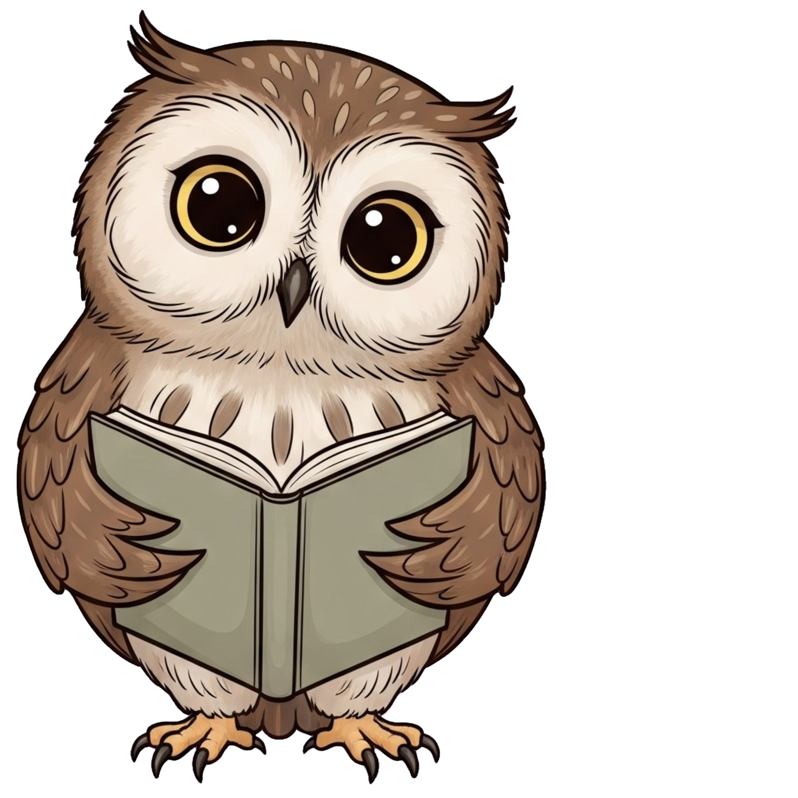

<h1 align="center">RAWINA 2.0</h1>



<p style="padding: 20px; font-size: 16px">
RAWINA est une application web Django permettant de générer automatiquement des histoires pour enfants (6–10 ans) à partir d’un prompt guidé. Le projet a été réalisé dans le cadre de la formation Simplon.</p>

## Objectif

L'objectif de cette application est de stimuler l’imaginaire des enfants en leur proposant des histoires originales à partir de choix simples. Chaque histoire est générée automatiquement et présentée dans une interface agréable, avec possibilité de téléchargement en PDF.

## Fonctionnalités actuelles

* Authentification utilisateur
* Choix du thème (animaux, fantastique, petit héros du quotidien)
* Formulaire guidé pour la génération d’histoires
* Génération de texte par un modèle de langage
* Visualisation des histoires dans une interface utilisateur simple
* Téléchargement des histoires en format PDF

## Technologies utilisées

* Python 3.12
* Django
* FastAPI
* Tailwind CSS (via django-tailwind)
* Langchain
* WeasyPrint (PDF)
* Docker

## Structure du projet

```
Simplon_Rawina2.0/
│
├── App/                       # Application Django principale
|   ├── App/
|       ├── settings.py        # Configuration Django
│       ├── urls.py            # Routage principal
│   ├── rawina/                # Gestion des histoires (modèles, vues, formulaires)
│   ├── users/                 # Authentification
│   ├── theme/
│       ├── static/            # Fichiers CSS, JS, images
│
├── ia_engine/
│   ├── nodes                  # Modules LLM internes
│   ├── llm_loader.py          # Chargement du modèle Groq
│
├── test_files                 # Fichiers pour tester les LLMs en ligne de commande
│
├── Dockerfile                # Image Docker
├── requirements.txt           # Dépendances
└── README.md
```

## Installation locale (développement)

1. Cloner le dépôt :

```bash
git clone https://github.com/Khadaassi/Simplon_Rawina2.0.git
cd Simplon_Rawina2.0
```

2. Créer un environnement virtuel :

```bash
python -m venv venv
source venv/bin/activate  # sous Linux/macOS
venv\Scripts\activate     # sous Windows
```

3. Installer les dépendances :

```bash
pip install -r requirements.txt
```

4. Lancer le serveur Django :

```bash
python manage.py migrate
python manage.py runserver
```

## Utilisation avec Docker

Assurez-vous d’avoir Docker installé puis construisez l’image :

```bash
docker build -t rawina-app .
```

Puis lancez le conteneur :

```bash
docker run -p 8000:8000 rawina-app
```

Un fichier `.env` est requis avec la variable suivante :

* GROQ\_API\_KEY (obligatoire pour générer du texte)

## Dépendances externes

* API GROQ pour la génération de texte
* Langchain pour l’orchestration des prompts
* WeasyPrint pour la génération de PDF

## À venir (prochaines étapes)

* Ajout de thème
* Possibilité de passer en mode saga (continuer une histoire avec les personnages et autres détails)
* Version multilingue

## Statut

Projet en développement. Version stable partielle disponible (génération de texte + affichage + export PDF).

## Auteur

Projet réalisé par Khadija Khadaassi, formation IA Simplon 2025.
